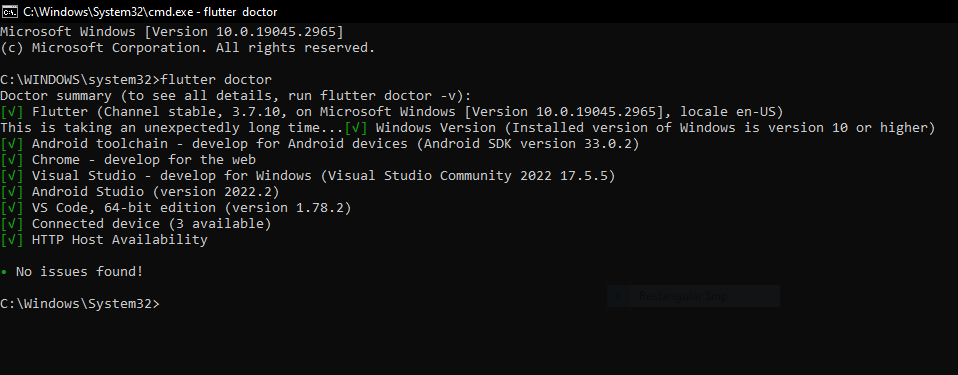
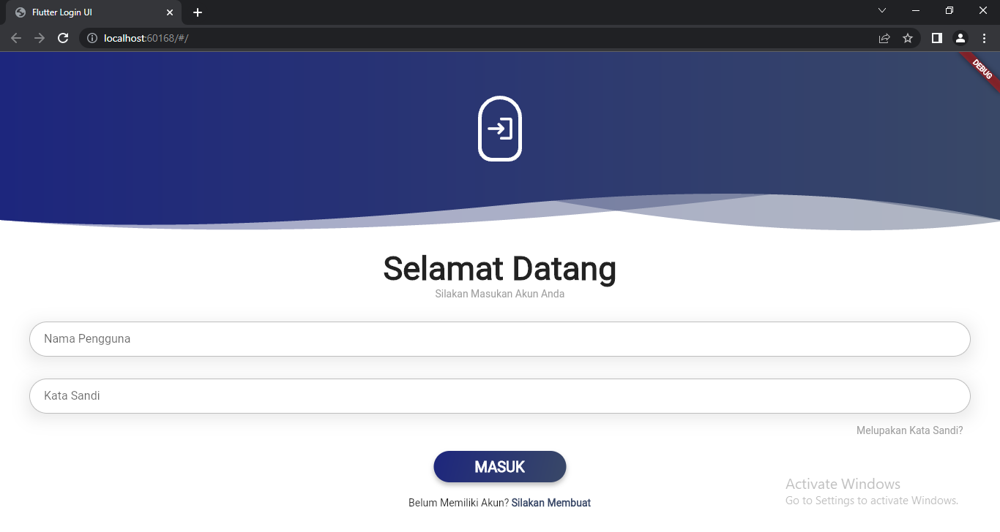
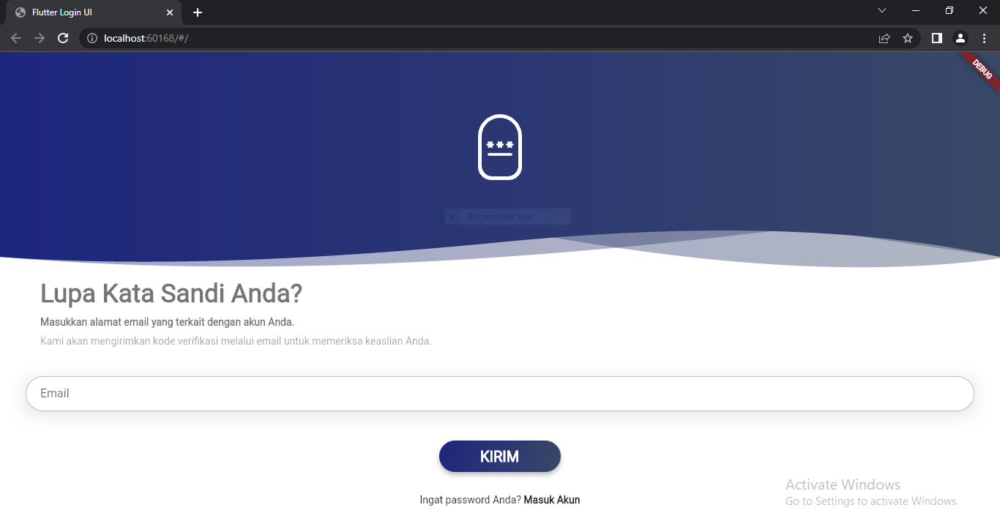
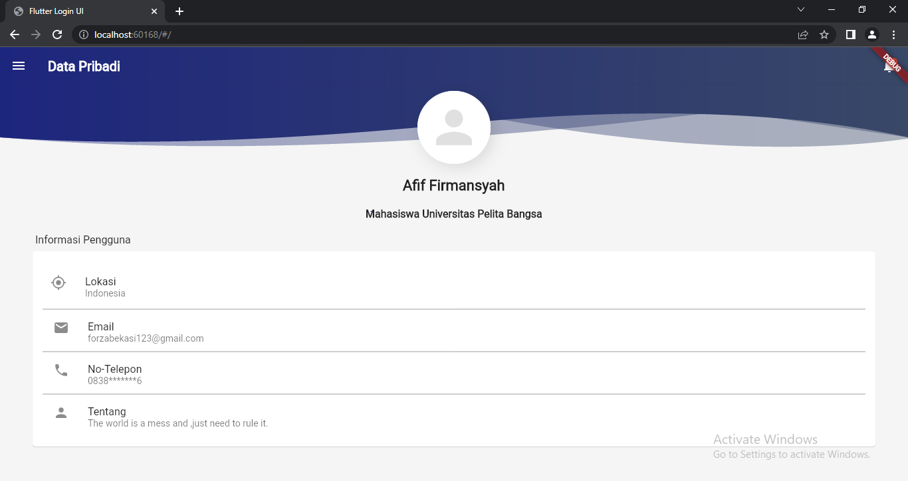
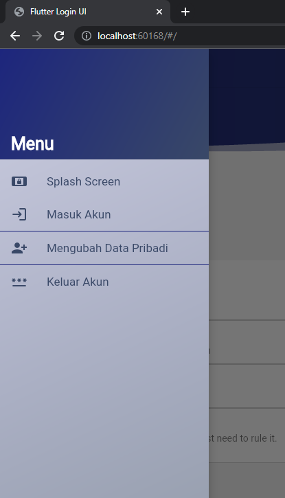
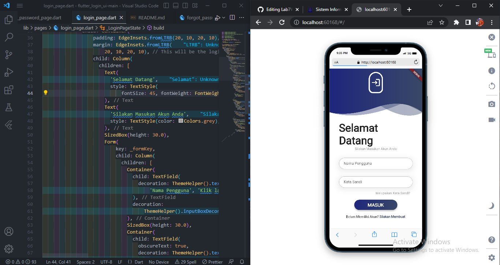
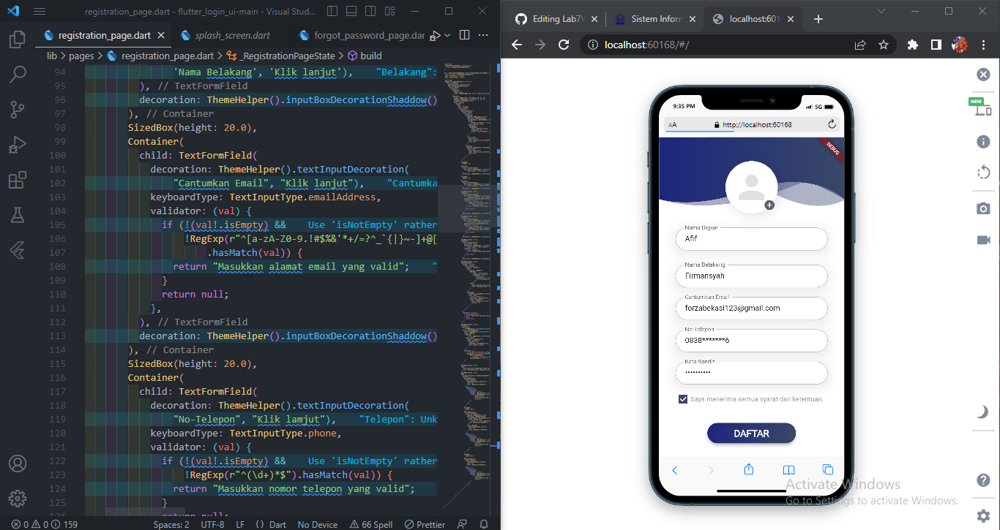
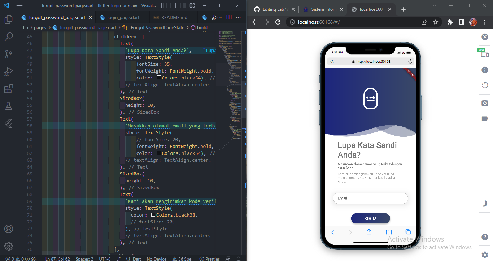
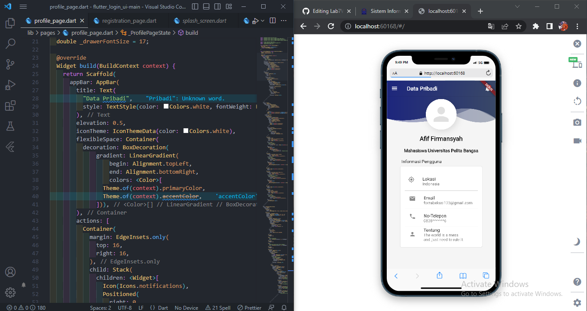
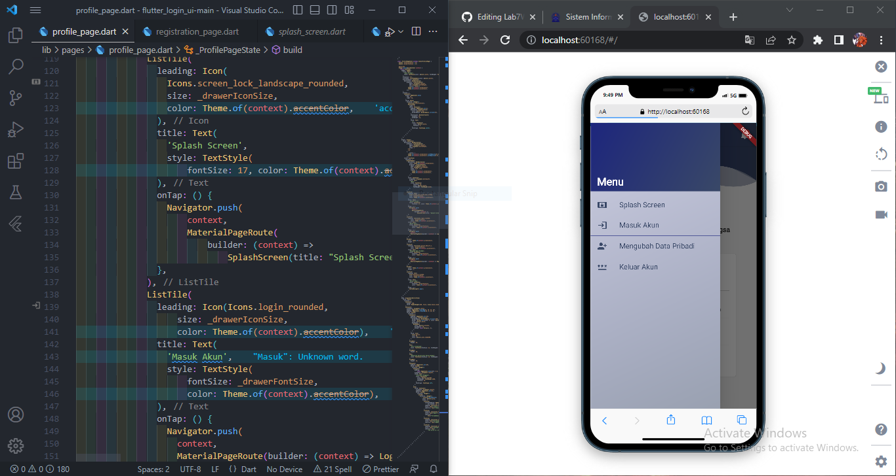

# UTS Pemograman Mobile 2

## Profil

| #               | Biodata              |
| --------------- | -------------------- |
| **Nama**        | Afif Firmansyah      |
| **NIM**         | 312110232            |
| **Kelas**       | TI.21.A1             |
| **Mata Kuliah** | Pemrograman Mobile 2 |

# Flutter

Flutter adalah platform yang digunakan para developer untuk membuat aplikasi multiplatform hanya dengan satu basis coding (codebase). Artinya, aplikasi yang dihasilkan dapat dipakai di berbagai platform, baik mobile Android, iOS, web, maupun desktop.

Flutter memiliki dua komponen penting, yaitu, Software Development Kit (SDK) dan juga framework user interface.

Flutter juga merupakan platform yang gratis dan open source. Jika Anda ingin menggunakan Flutter, Anda perlu mempelajari bahasa pemrograman Dart. Berbeda dengan framework front-end pada umumnya, di mana JavaScript adalah bahasa pemrogramannya.

# Install

Untuk menjalankan Flutter Anda butuh menginstall flutter tersebut dan sistem yg dibutuhkan. Berikut ini lah Caranya :

1. Buka situs web resmi Flutter 4 di (https://docs.flutter.dev/get-started/install) dan pilih sistem operasi Anda `Windows/MacOS/Linux` klik tombol `flutter_windows_stable_zip` di menu "Get the Flutter SDK".
2. Setelah selesai mengunduh, ekstrak file kedalam folder C/D.
3. Lalu `Setting Environment Variabelnya`.
4. Jika sudah ,Download sistem yg dibutuhkan Seperti Berikut.

5. Kalau sudah semua ,Jangan lupa untuk mendownload extensions Flutter dan Dart di VSC.

# Membuat Halaman Login

Untuk tugas UTS kali ini kita akan membuat `Halaman Login` menggunakan Flutter ,Dan berikut inilah Kodingan dan hasilnya : 

## Tampilan Untuk di PC

## Tampilan Untuk di Android Beserta Kodingannya

# Terima Kasih!!!
